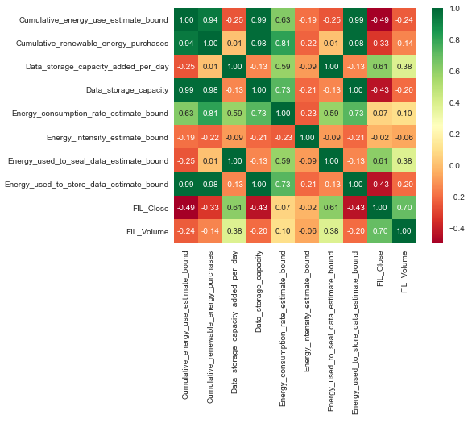
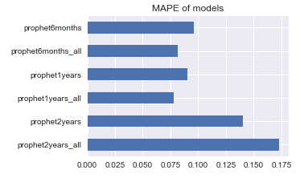

# Report of Storage Network Energy Consumption Data Challenge

---
## 1. Global analysis
### Input data description
- We downloaded Filecoin files from https://filecoin.energy/ for the following period: August 25, 2020 - November 30, 2022.
- We merged this data with Filecoin prices and volumes.
- On the picture below have shown the plots of all features in our dataset:

### Energy performance
- For analysing energy performance let's look at the Energy intensity variable. It is calculated as total electrical power used by the Filecoin network divided by data storage Capacity. Measured in MW/EiB.
- We have a huge values at the start period hence it is hard to see something useful on the chart. Let's look at the period August 25, 2020 - November 30, 2020. Estimated intensity have been improved on 3867 MW/EiB (from 3906 MW/EiB to 39 MW/EiB). Such huge improvement described by the anomaly high values on the start due to system onboarding process.
- For the last 2 years Estimated intensity have been improved on about 33 MW/EiB (from 39 MW/EiB to 6 MW/EiB).
    - First year improvement on about 29 MW/EiB (from 39 MW/EiB to 10 MW/EiB).
    - Second year improvement on about 4 MW/EiB (from 10 MW/EiB to 6 MW/EiB).
- Let's look at the monthly absolute and percentage differences for the last 2 years. We see that in July, as a rule, there is a drop in performance. Also, the increase in performance over time becomes damped and in the last 3 months we have a performance increasing about 5% from month to month.

### Filecoin storage
- For analysing Filecoin storage let's look at the Data_storage_capacity variable. It is measured in GiB.
- For the last 2 years the Data storage capacity have been increased on about 20.2 EiB (from 1.3 EiB to 21.5 EiB).
    - First year improvement on about 13 EiB (from 1.3 EiB to 14.3 EiB).
    - Second year improvement on about 7.2 EiB (from 14.3 EiB to 21.5 EiB).
- Let's look at the monthly absolute and percentage differences for the last 2 years. The increase in Data storage capacity over time becomes damped and in the last 5 months we have a storage increasing about 2% from month to month.

### Renewable energy purchases
- For analysing Renewable energy let's look at the Cumulative_renewable_energy_purchases variable. It is measured in kWh.
- For the last 2 years the Renewable energy purchases have been increased on about 2937 GWh (from 58 GWh to 2995 GWh).
    - First year improvement on about 2400 GWh (from 58 GWh to 2457 GWh).
    - Second year improvement on about 538 GWh (from 2457 GWh to 2995 GWh).
- Let's look at the monthly absolute and percentage differences for the last 2 years. The increase in Renewable energy purchases over time becomes damped and in the last 1 year we have a increase about 1-2% from month to month. But the last 2 months there was no increases.

---
## 2. Correlations
### Pearson correlation matrix between all input features:

### From the correlation matrix above we can highlight some facts:
- All lower,estimate,upper bounds by the corresponding feature have correlations equals 1 with each other. It comes from their definition because they differ from each other by a multiplicative factor.
- All Filecoin prices have correlations equals 1 with each other. Also Volumes have sufficiently high correlation with price - about 0.7.
- Let's simplify correlation matrix by use only ones from that correlated features

### Pearson correlation matrix between selected features:

### From the correlation matrix above we can highlight some facts:
- Correlation between Energy_used_to_seal_data and Data_storage_capacity_added_per_day equals 1. It means that one is linearly depends on other.
- Correlation between Energy_used_to_store_data and Data_storage_capacity equals 1. It means that one is linearly depends on other.
- Data_storage_capacity have correlations near to 1 with Cumulative_energy_use_estimate_bound and Cumulative_renewable_energy_purchases.

### Pearson correlation matrix after elimiation of highly correlated features:

### Correlations with the features in the task and Filecoin Close price:
- Energy_used_to_seal_data = 0.61.
- Data_storage_capacity_added_per_day = 0.61 (the same as previous because they are linearly dependent).
- Energy_consumption_rate_estimate_bound = 0.07.

### The dependancies between Filecoin Price (left axis, blue marker) and features in the task (right axis, green marker):

----
## 3. Modelling
We have used the prophet model for getting the final predictions (https://facebook.github.io/prophet/). 
For the validation set we used the last 3 months: Nov, Oct, Sep. For the validation metric we have used Mean Absolute Percentage Error.
We have chosed the best model from the following list:
- prophet2years_all: Train on the last 2 years data. Use weekly and yearly seasonality.
- prophet2years: Train on the last 2 years data. Use only weekly seasonality.
- prophet1years_all: Train on the last 1 year data. Use weekly and yearly seasonality.
- prophet1years: Train on the last 1 year data. Use only weekly seasonality.
- prophet6months_all: Train on the last 6 months data. Use weekly and yearly seasonality.
- prophet6months: Train on the last 6 months data. Use only weekly seasonality.

### Mean average percentage score of different models:

### Best model predictions:

### Best models components:
